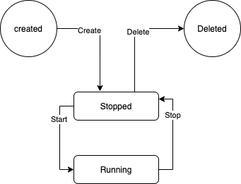

Привет! 
Это дополнительное задание, которое мы будем развивать несколько недель. К концу семестра мы должны получить проект
аналогичный https://track.toggl.com/timer.

### Часть 0

Заводим аккаунт на github.com

Установить на свой рабочий компьютер git (https://git-scm.com/). Прочитать немного, что это такое (например, https://githowto.com/ru)

Локально на компьютере создаем папку, в которой будут хранится проекты, например  
```
olga$ mkdir seminar3 
olga$ cd seminar3
olga$ git clone https://github.com/OKriw/Seminar3.git
```


В консоли будет что-то такое:  
```
Cloning into 'Seminar3'...  
remote: Enumerating objects: 15, done.  
remote: Counting objects: 100% (15/15), done.  
remote: Compressing objects: 100% (11/11), done.  
remote: Total 15 (delta 2), reused 6 (delta 2), pack-reused 0  
Unpacking objects: 100% (15/15), done.  
Olgas-MacBook-Pro:sem3 olga$ ls  -al  
total 0  
drwxr-xr-x   3 olga  staff    96 Sep 16 20:29 .  
drwxr-xr-x@ 76 olga  staff  2432 Sep 16 20:27 ..  
drwxr-xr-x  11 olga  staff   352 Sep 16 20:29 Seminar3 
```

Далее создаем свою ветку и переключаемся в нее:
```
git branch Your-name-semina3-timer
git checkout Your-name-semina3-timer
```
 ###### Важно!
 Всю разработку ведем строго в своей ветке.

Идем в папку Seminar3 и смотрим что к чему.
Открываем проект в своей среде разработки, я пользуюсь CLion.
### Часть 1 
##### Пишем простой трекер временни.
В toogle timer можно дать имя своей активности - задачи, дела и тд., нажать кнопку старт и начнется отсчет времени.  
Как только вы сменили активность или закончили работать можно остановить таймер и увидеть время затраченное на задачу.
Потом можно вернуться снова к этой задаче или начать новую, причем время для одной и той же задачи будет все время расти.
На сегодняшнее занятие мы с вами сделаем такой таймер.

Смотрим на `class Timer` - ваша задача написать обьявленные функции,
собрать и запустить проект, раскоментировать содержимое функции `main` и убедится что вы получили такой вывод. 

```
--Task checks--

seminar3 --  00:00:00
seminar3 --  00:00:04
seconds spent on seminar3 04
--Task checks End--
```
Теперь пройдемся по функциям:
```
    void start_timer();
    void stop_timer(); 
```
Основные функции нашего таймера - вызвали старт начался отсчет, нажали стоп -  
дальше не трекаем, снова старт - продолжаем увеличивать время счетчика.
Единственная функция которая может сбросить время - `void clear_timer();`  
После нее отсчет снова начинается с 0.  
`void print_time();` - вывести время в виде hh:mm:ss  

`int get_elapsed_time(char fmt);`  - вернуть время в секундах/минутах/часах  
`string format_elapsed_time();` - вернуть строку вида hh:mm:ss

После того как проверили делаем свой коммит.
```
git status
git add <list of files>
git commit -m "<message for commit>"
```


##### Полезные ссылки:
 * https://habr.com/ru/post/324984/ подсмотреть как использовать chrono
 
 ### Часть 2
 #### Console:
 
<pre>
git checkout master - пееключаемся на мастер
git pull - забираем к себе изменения
</pre>
Давайте вернемся к классу Task и подумаем о жизненном цикле task и ее состояниях. И попытаемся договорится о правилах которым будет следовать
наше приложение.

<pre>
Task.h:
 enum states {
    stopped, 
    running,
    deleted 
};
class Task {
private:
    ...
    bool isValid(states new_state);
    states state;
public:
    ...
    bool isRunning();
    bool isStopped();
    bool isDeleted();
    states getState();
    ...
    void delete_t();
};
 </pre>
 
  
 Теперь Task хранит не только имя и таймер, но и состояние текущей задачи.
 
 Задача 1: реализовать класс Mgr, который отвечает за проверку корректности состояний задачи.
 Условия - обсуждаем на семинаре.
 Для нас важно, чтобы в нашей программе можно создать единственный экземпляр менеджера. //sigleton
 
 Задача 2:
 Реализовать класс Client который  обрабатывает ввод с консоли и понимает что подьзователь
 хочет сделать - создать, запустить или удалить задвчу:
 <pre>
 create/start/stop task_name - create/start/stop task with task name task_name
 help - вывести описание всех доступных команд
 stat task_name - вывести время потаченное на задачу с именем task_name
 quit - выйти из приложения
 При введении некорректной команды печатать OPTION UNKNOWN
 </pre>
 Пример работы приложения:
<pre>
Olgas-MacBook-Pro:TTimer olga$ ./cmake-build-debug/TTimer
create Task1
start Task1
stop Task1
stat Task1
Task1 --  00:00:05
create Task2
stop Task2
Error stopping task Task2, state: 0
start Task2
startTask2
OPTION UNKNOWN
use 'help' to get help
start Task2
Error starting task Task2 ,state: 1
stop Task2
stat Task2
Task2 --  00:00:19
 </pre>

 Полезные ссылки:
https://gameprogrammingpatterns.com/singleton.html
https://gameprogrammingpatterns.com/state.html
https://habr.com/ru/post/166201/
https://stackoverflow.com/questions/16388510/evaluate-a-string-with-a-switch-in-c
